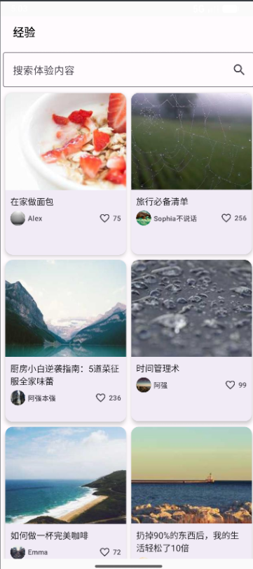
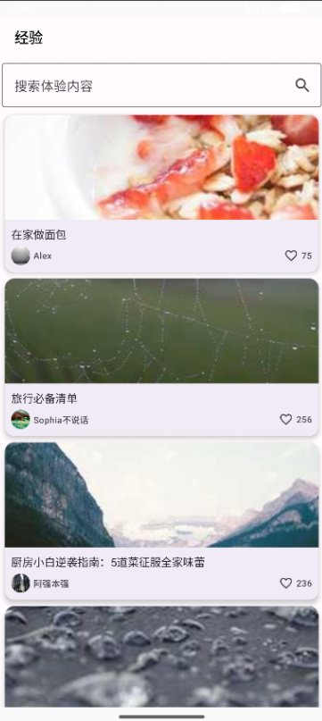
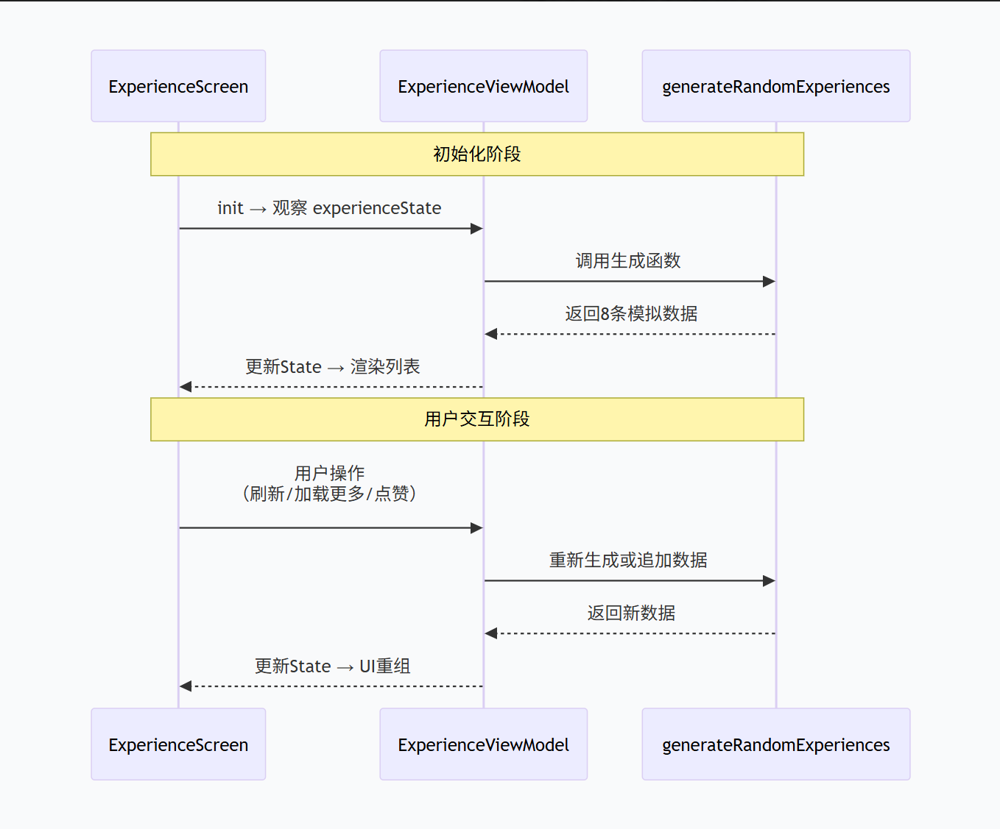
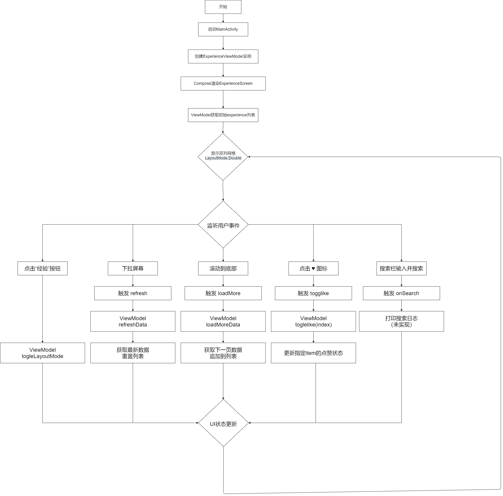

 # 作业一  高仿抖音经验频道

---

这是一个使用Jetpack Compose + ViewModel + StateFlow 构建的仿经验频道 展示界面App

## 效果图

|                           双列模式                           |                           单列模式                           |
| :----------------------------------------------------------: | :----------------------------------------------------------: |
|  |  |

## 序列图



## 流程图



## 核心功能实现

- 瀑布流布局：实现抖音经验页的双列瀑布流界面，支持动态高度适配
- 经验卡片 UI 组件：包含图片、标题、用户头像、用户名、点赞数等核心元素
- 点赞交互功能：支持点击点赞图标切换点赞状态，实时更新点赞计数
- 数据刷新机制：实现上拉加载更多数据和下拉刷新最新内容的功能
- 数据配置管理：支持 Mock 数据模拟，配置网络图片资源，确保数据可动态更新
- 预加载优化：支持卡片预加载和图片预加载，提升滑动流畅度
- 图片缓存：实现图片缓存策略
- 搜索栏（UI 已实现，逻辑待接入）
- 布局灵活性：支持瀑布流布局在双列和单列模式间动态切换 点击“经验”按钮实现单双列切换

##  技术栈

| 类别         | 技术                                        |
| ------------ | ------------------------------------------- |
| **UI 框架**  | Jetpack Compose (Material 3)                |
| **状态管理** | `StateFlow` + `ViewModel`                   |
| **图片加载** | Coil (`AsyncImage`)                         |
| **下拉刷新** | Accompanist SwipeRefresh                    |
| **异步模拟** | `Handler.postDelayed`（演示用）             |
| **布局组件** | `LazyVerticalGrid`, `Card`, `Column`, `Row` |
| **开发工具** | Android Studio                              |

## 项目结构解析

------

## 整体架构：MVVM + 响应式 UI

| 层级          | 组件                  | 职责                                       |
| ------------- | --------------------- | ------------------------------------------ |
| **Model**     | `ExperienceItem`      | 不可变数据模型，承载单条内容               |
| **View**      | `ExperienceScreen`    | 纯 UI 层，无业务逻辑，响应状态变化         |
| **ViewModel** | `ExperienceViewModel` | 状态持有者，处理数据加载、点赞、刷新等逻辑 |
| **入口**      | `MainActivity`        | 启动 Compose 树，注入 ViewModel            |

------

##  核心模块详解

### 1. 数据模型 ExperienceItem.kt

```kotlin
data class ExperienceItem(
    val id: Int,
    val imageUrl: String,
    val title: String,
    val avatarUrl: String,
    val username: String,
    val likeCount: Int,
    val isLiked: Boolean = false
)
```

- **不可变性**：所有字段为 `val`，配合 `copy()` 实现安全更新（如点赞）。
- **自解释性强**：字段命名直观，无需额外文档即可理解用途。
- **兼容网络/本地**：`imageUrl` 和 `avatarUrl` 可无缝对接真实 API 或 Mock 数据。

------

### 2. UI 层：Compose 函数组合

####  `ExperienceScreen.kt` 主界面容器

- 集成 **搜索栏 + 瀑布流内容区**。
- 支持 **单列 / 双列布局切换**，适配不同内容密度。
- 内置：
  - **下拉刷新**：通过 `SwipeRefresh` 触发 `viewModel.refresh()`
  - **上拉加载更多**：监听滚动位置，自动调用 `viewModel.loadMore()`
  - **状态驱动 UI**：实时响应 `experiences`、`isRefreshing`、`isPreloading` 等状态变化

#### `ExperienceCard.kt`  单条内容卡片

- 采用 **图片 + 文字 + 用户信息** 的三段式布局。
- 图片使用 **3:2 高宽比**（双列）或 **2:1**（单列），视觉比例协调。
- 关键细节：
  - 封面图：`AsyncImage` 懒加载 + `ContentScale.Crop`
  - 标题：最多显示 26 个字符，超长自动省略（`TextOverflow.Ellipsis`）
  - 头像：圆形裁剪（`CircleShape`）
  - 点赞图标：根据 `isLiked` 动态切换颜色与计数

#### `SearchBar`  搜索输入框

- 基于 `OutlinedTextField` 实现，带搜索图标。
- 支持软键盘“搜索”键触发，预留业务接入点（当前仅日志输出）。

------

### 3. **逻辑层：`ExperienceViewModel.kt`**

作为**状态管理中心**，负责所有业务逻辑与数据流：

| 功能             | 实现方式                                                    |
| ---------------- | ----------------------------------------------------------- |
| **管理经验列表** | `MutableStateFlow<List<ExperienceItem>>`                    |
| **点赞交互**     | 通过 `copy()` 创建新对象，安全更新 `isLiked` 与 `likeCount` |
| **下拉刷新**     | 清空并生成 8 条全新随机数据（模拟 API 刷新）                |
| **上拉加载更多** | 追加 4 条新数据，配合 `_isPreloading` 防重复请求            |
| **加载状态控制** | 提供 `isRefreshing` 和 `isPreloading` 供 UI 显示 loading    |
| **模拟数据生成** | 使用 Picsum.photos 随机图片 + 多样化文案池，高度拟真        |

4. **入口层：`MainActivity.kt`**

- 标准 Compose 应用入口，继承 `ComponentActivity`。

- 关键配置：

  ```
  setContent {
      MaterialTheme {
          Surface(modifier = Modifier.fillMaxSize().systemBarsPadding()) {
              val viewModel = viewModel<ExperienceViewModel>()
              ExperienceScreen(viewModel)
          }
      }
  }
  ```

- 自动适配系统状态栏与手势导航区域（`systemBarsPadding()`），提升沉浸感。

- 显式注入 `ExperienceViewModel`，确保类型安全与可测试性。

## 如何运行

---

- 克隆项目
- 打开 Android Studio
- 连接设备或启动模拟器
- 点击Run

## 开发总结：关键技术问题与优化思路

---

在开发“抖音风格经验分享列表”应用的过程中，我深入实践了 Jetpack Compose 的声明式 UI 编程范式，并围绕状态管理、性能优化与用户体验进行了多次迭代。以下是开发中遇到的几个核心问题及解决/优化方案

### 问题1 ：使用索引更新点赞状态导致数据错位

**现象**：

 在实现点赞功能时，最初通过 `LazyVerticalGrid` 提供的 `index` 参数调用 `viewModel.toggleLike(index)`。但在下拉刷新或加载更多后，列表内容顺序变化，再次点击原位置卡片时，实际更新的是新内容的点赞状态，造成逻辑错乱。

**原因分析**：
 `index` 仅表示当前 UI 列表中的位置，不具备唯一性。一旦数据源变更（如刷新、过滤），相同 `index` 对应的 `ExperienceItem` 已不同。

**优化思路**：改用唯一 ID 匹配

- 在 `ExperienceItem` 中保留 `id` 字段（生成时确保唯一）
- `toggleLike(id: Int)` 方法通过遍历列表匹配 `item.id == id`
- UI 层传递 `item.id` 而非 `index`

```
fun toggleLike(id: Int) {
    _experiences.value = _experiences.value.map { item ->
        if (item.id == id) {
            item.copy(
                isLiked = !item.isLiked,
                likeCount = item.likeCount + if (item.isLiked) -1 else 1
            )
        } else item
    }
}
```

------

### 问题2：图片 URL 缓存导致刷新后图片不变

**现象**： 多次下拉刷新后，部分卡片图片未更新，仍显示旧图。

**原因分析**：

Picsum.photos 默认会缓存相同 URL 的图片。虽然我在 URL 中加入了 `System.currentTimeMillis()`，但由于刷新间隔短，时间戳可能相同（尤其在快速操作时），导致 Coil 认为是同一资源而直接返回缓存。

**优化思路**：增强随机性，确保 URL 唯一

- 改用 `Random.nextInt()` 作为随机参数，而非依赖时间戳
- 或显式禁用 Coil 缓存（不推荐，影响性能）

```
imageUrl = "https://picsum.photos/300/${h}?random=${Random.nextInt()}"
```

------

### 问题3：上拉加载触发过于频繁，造成重复请求

**现象**：快速滑动到底部时，`loadMore()` 被多次调用，短时间内追加多批数据，体验混乱。

**原因分析**：

 滚动监听逻辑未做充分防抖，仅靠 `_isPreloading` 标志无法完全拦截高频触发（因状态更新有延迟）。

**优化思路**：双重防护机制

1. **状态锁**：保留 `_isPreloading`，加载期间禁止新请求
2. **滚动节流**：在 Compose 层面对 `LazyListState` 的监听添加 debounce（例如仅当 lastVisibleItemIndex 稳定后才触发）

------

### 问题4：长标题溢出破坏布局美观

**现象**：部分标题超过两行，挤压底部用户信息区域，甚至导致头像错位。

**优化思路**：UI 层主动约束文本显示

- 限制最大字符数（如 26 字）
- 使用 `Text(maxLines = 2, overflow = TextOverflow.Ellipsis)`
- 固定卡片内部各区域高度，避免内容高度塌陷
- 保证卡片高度一致，提升整体视觉秩序感。

```
Text(
    text = if (title.length > 26) title.take(26) + "…" else title,
    maxLines = 2,
    overflow = TextOverflow.Ellipsis,
    style = MaterialTheme.typography.bodyMedium
)
```

---

通过本次开发，我不仅掌握了 Jetpack Compose 的基础组件与状态管理机制，更深刻理解了 **“状态驱动 UI”** 的设计哲学。每一个问题的解决过程，都是对 **健壮性、性能与用户体验** 的再思考。未来将进一步引入真实网络请求、持久化存储与动画交互，持续打磨产品细节


